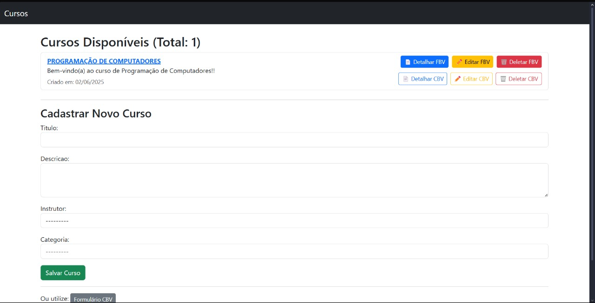
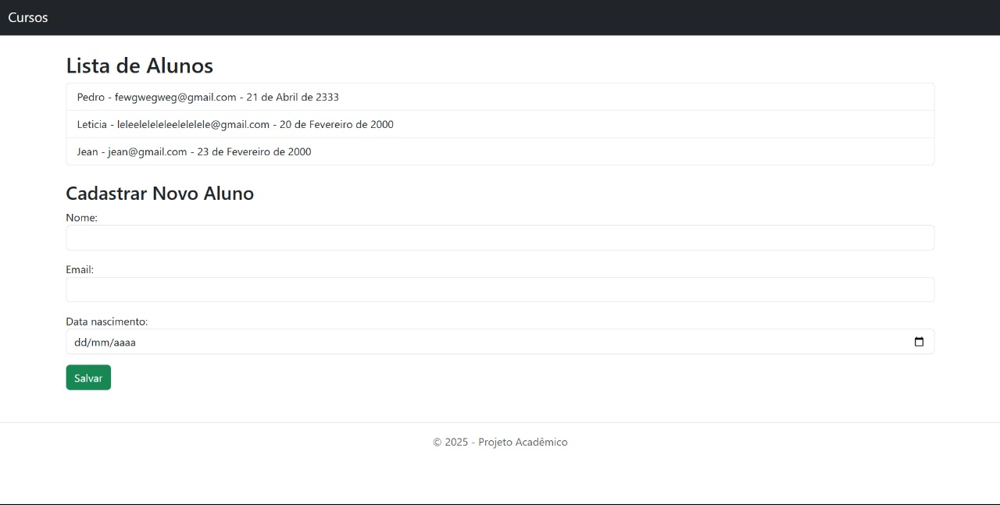
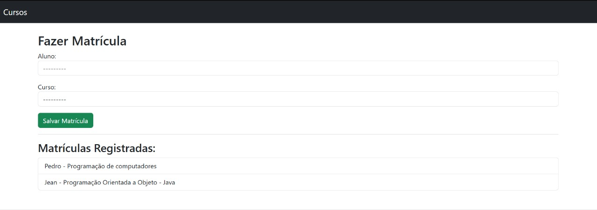

# 🎓 Sistema Acadêmico Django

Projeto final da disciplina de **Programação de Computadores**. Este sistema permite cadastrar cursos, alunos e matrículas usando Django, aplicando todos os conceitos fundamentais da disciplina.

---

## 📌 Objetivo
Demonstrar o uso de:
- lógica de programação,
- estruturas condicionais e de repetição,
- organização de dados (modelos),
- modularização com funções,
- testes automatizados,
- e versionamento com Git/GitHub,

tudo isso aplicado em um sistema acadêmico realista.

---

## 💡 Problema Resolvido
Muitos sistemas escolares não possuem uma forma simples de organizar cursos, alunos e matrículas. Este projeto simula um ambiente funcional para gerenciamento educacional, ideal para escolas, cursos online ou treinamentos corporativos.

---

## 🖼️ Exemplos Visuais do Sistema

### 📚 Tela de Cursos


### 👨‍🎓 Tela de Alunos


### 📝 Tela de Matrículas


---

## 🛠️ Tecnologias Utilizadas
- Python 3
- Django
- HTML/CSS (Templates)
- SQLite (Banco de dados embutido)
- Git e GitHub

---

## 👥 Participantes
- **Pedro Henrique Farias da Silva** 
- **Yuri Henrique Valadares**
- **Samuel Cavalcante da Silva Calvão**
- **Jean Salton**
- **Diego Santana**

---

## ✅ Funcionalidades
- Cadastro e listagem de **cursos**
- Cadastro e listagem de **alunos**
- Matrícula e listagem de **alunos em cursos**
- Visualização de detalhes e formulários de edição
- Validações via formulário
- Organização com views baseadas em função

---

## 🧪 Testes Automatizados
O projeto inclui testes nos modelos que têm uso direto nos templates:

- **Curso**
- **Aluno**
- **Matrícula**

### Exemplo de execução:
```bash
Ran 3 tests in 0.004s
OK

---

## 🔚 Conclusão e Possíveis Melhorias

Este projeto permitiu consolidar na prática os principais conceitos estudados na disciplina de Programação de Computadores, como lógica condicional, estruturas de repetição, modularização com funções, manipulação de dados e uso de frameworks. Os testes automatizados ajudaram a garantir o funcionamento correto do sistema.

Como melhorias futuras, o sistema poderia incluir autenticação de usuários (login/senha), painel administrativo com permissões e a adição de filtros ou buscas inteligentes nos registros.

A experiência com o GitHub também fortaleceu o trabalho em equipe, versionamento e documentação do projeto.

---

## 📚 Fundamentação Teórica e Referências

O projeto foi desenvolvido com base em conceitos apresentados em aula e aprofundado por meio da documentação oficial do Django e de bibliografia complementar:

- [Django Models](https://docs.djangoproject.com/en/5.1/topics/db/models/)
- [Django Templates](https://docs.djangoproject.com/en/5.2/topics/templates/)
- [Template Language](https://docs.djangoproject.com/en/5.2/ref/templates/language/)
- [Template Tags e Filters](https://docs.djangoproject.com/en/5.2/ref/templates/builtins/)
- **Livro: Lógica de Programação e Algoritmos** – livro que eu utilizei em casa antes mesmo de iniciar o curso.